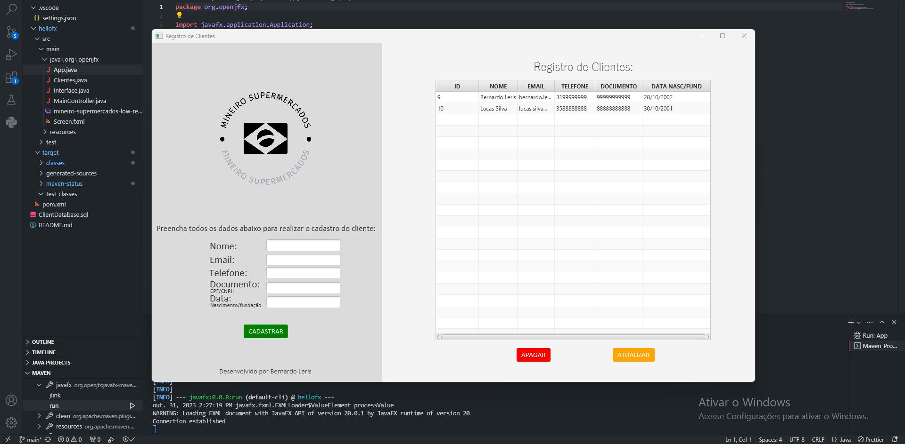

## Client Registry System

### EN-US:
### Description:
This is a customer registration application developed in Java using the JavaFX platform for the graphical user interface, PostgreSQL for storing customer records, and Maven for dependency management.

### PT-BR:
### Descrição:
Esta é uma aplicação de registro de clientes desenvolvida em Java, utilizando a plataforma JavaFX para a interface gráfica do usuário, PostgreSQL para armazenar os registros dos clientes e Maven para o gerenciamento de dependências.

